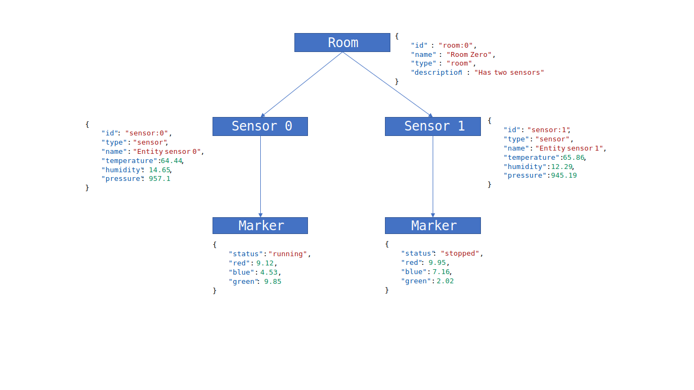

# HexaDb
## A schemaless graph database based on RocksDb

HexaDb is a triple based graph data store created on RocksDb storage. It can be used to store, retrieve and query JSON documents.
HexaDb does not require a schema. It also supports relational query through providing nested path or nesting level
in any arbitrary JSON document.

## Naming

HexaDb breaks JSON documents to RDF triples in the format of `(S,P,O)` and creates six indices. All triples are queryable by those six indices
`S,
P,
O,
SP,
PO,
OS`

Thus **HexaDb**.

## Building and running locally

`$ docker-compose up`

## Explore through Postman
[](https://app.getpostman.com/run-collection/8901e8658605b63f1edc#?env%5BHexDocker%20Local%20%5D=W3sia2V5IjoiaG9zdCIsInZhbHVlIjoibG9jYWxob3N0IiwiZW5hYmxlZCI6dHJ1ZX0seyJrZXkiOiJwb3J0IiwidmFsdWUiOiI4MDAwIiwiZW5hYmxlZCI6dHJ1ZX0seyJrZXkiOiJhcHBJZCIsInZhbHVlIjoiYXBwMDAyIiwiZW5hYmxlZCI6dHJ1ZX1d)

## Getting started with the API's

Let's create a graph. First we will create two object's with nested JSON. Internally in HexaDb every nested object is considered a top level object with an incoming relationship.

Later, we will create another object that references other objects by id.

### Creating your first objects

`POST /api/store/app01`

```json
[
    {
        "id": "sensor:0",
        "type": "sensor",
        "name": "Entity sensor 0",
        "temperature": 64.44,
        "humidity": 14.65,
        "pressure": 957.1,
        "marker": {
            "status": "running",
            "red": 9.12,
            "blue": 4.53,
            "green": 9.85
        }
    },
    {
        "id": "sensor:1",
        "type": "sensor",
        "name": "Entity sensor 1",
        "temperature": 65.86,
        "humidity": 12.29,
        "pressure": 945.19,
        "marker": {
            "status": "stopped",
            "red": 9.95,
            "blue": 7.16,
            "green": 2.02
        }
    }
]
```
The top level objects in the POST call need to have an id field. The nested objects will be assigned id's based on the top level id. This POST call creates four different objectswith links. Nested objects are considered top level and can be queried indepently. 

### Get a document by id

`GET /api/store/app01/sensor:1`

### Find a document by a top level property comparison

`POST /api/store/app01/query`

```json
{
    "filter": {
        "type": {
            "op": "eq",
            "value": "sensor"
        },
        "temperature" : {
            "op" : "gt",
            "value" : 65,
        }
    }
}
```

### Create a relationship

Posting a nested object automatically creates relationships. In HexaDb all objects are considered to be a top-level object. New objects and relationships can be created with just another POST with id references to existing objects. This is similar to POST with inline objects. But the object does not need to be inline. An id reference to an existing object is good enough.

`POST /api/store/app01`

```json
{
    "id" : "room:0",
    "name" : "Room Zero",
    "type" : "room",
    "description" : "Has two sensors",
    "sensors" : [
        {
            "id" : "sensor:0"
        },
        {
            "id" : "sensor:1"
        }
    ]
}
```

This creates the following structure




### Find a document by relationship query

`POST /api/store/app01/query`

```json
{
    "filter": {
        "type": {
            "op": "eq",
            "value": "room"
        },
        "outgoing": [
            {
                "path": "sensors#marker",
                "target": {
                    "filter": {
                        "green": {
                            "op": "gt",
                            "value": 9
                        }
                    }
                }
            }
        ]
    }
}
```

### Find a document by nesting level

`POST /api/store/app01/query`

```json
{
    "filter": {
        "type": {
            "op": "eq",
            "value": "room"
        },
        "outgoing": [
            {
                "path": "*",
                "level" : 3,
                "target": {
                    "filter": {
                        "green": {
                            "op": "gt",
                            "value": 9
                        }
                    }
                }
            }
        ]
    }
}
```

### Update a document

`PATCH /api/store/app01/json`

A json-merge-patch style endpoint is available. Below is an example that changes the name of the object pointed to by `sensor:0` and modifies the `marker` relationship to contain a single object with no `status` (deleted) and value of `red` with `1.0`.

```json
{
    "id": "sensor:0",
    "name": "Another name",
    "marker": {
        "status": null,
        "red": 1.0
    }
}
```
Also see [wiki](https://github.com/angshuman/hexadb/wiki/Simple-Relationships "Simple Relationships")


