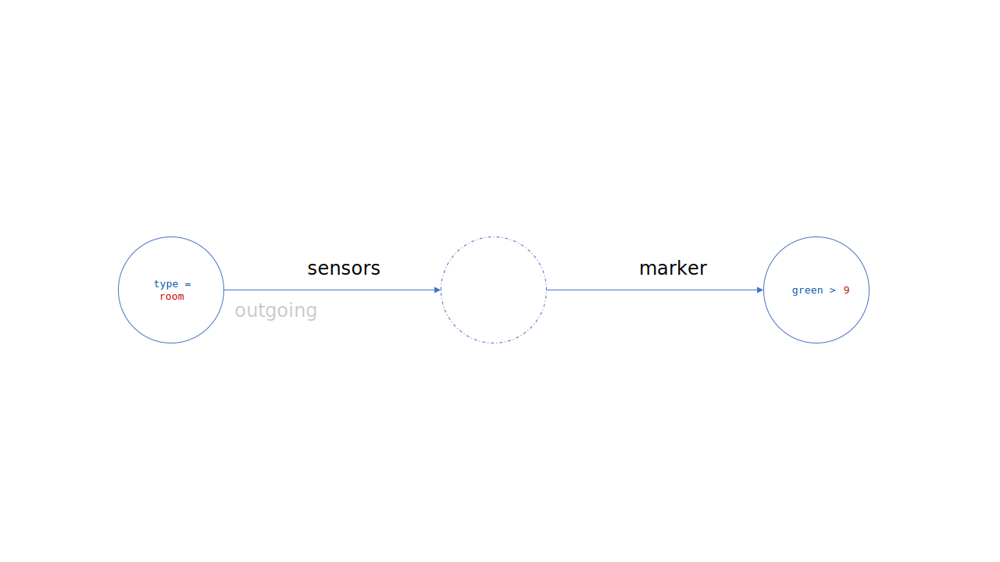

# HexaDb
## A schemaless graph database based on RocksDb

HexaDb is a triple based graph data store created on RocksDb storage. It can be used to store, retrieve and query JSON documents.
HexaDb does not require a schema. It also supports relational query through providing nested path or nesting level
in any arbitrary JSON document.

## Naming

HexaDb breaks JSON documents to RDF triples in the format of `(S,P,O)` and creates six indices. All triples are queryable by those six indices
`S,
P,
O,
SP,
PO,
OS`

Thus **HexaDb**.

## Building and running locally

`$ docker-compose up`

For more detailed documentation take a look at the [wiki](https://github.com/angshuman/hexadb/wiki/Simple-Relationships "Simple Relationships")

You can also find example scenarios at [hexadb-examples](https://github.com/angshuman/hexadb-examples "Hexadb Examples")

## Getting started with the API's

Let's create a graph. First we will create two object's with nested JSON objects. Later, we will create another object that references these objects by id.

### Creating your first objects

`POST /api/store/app01`

```json
[
    {
        "id": "sensor:0",
        "type": "sensor",
        "name": "Entity sensor 0",
        "temperature": 64.44,
        "humidity": 14.65,
        "pressure": 957.1,
        "marker": {
            "status": "running",
            "red": 9.12,
            "blue": 4.53,
            "green": 9.85
        }
    },
    {
        "id": "sensor:1",
        "type": "sensor",
        "name": "Entity sensor 1",
        "temperature": 65.86,
        "humidity": 12.29,
        "pressure": 945.19,
        "marker": {
            "status": "stopped",
            "red": 9.95,
            "blue": 7.16,
            "green": 2.02
        }
    }
]
```
The top level objects in the POST call need to have an id field. The nested objects will be assigned id's based on the top level id. This POST call creates four different objectswith links. Nested objects are considered top level and can be queried indepently. 

### Get an object by id

`GET /api/store/app01/sensor:1`

### Find an object by a top level property comparison

`POST /api/store/app01/query`

This query finds all object with `type` of `sensor` and with a `temperature` property > `65`.

```json
{
    "filter": {
        "type": {
            "op": "eq",
            "value": "sensor"
        },
        "temperature" : {
            "op" : "gt",
            "value" : 65,
        }
    }
}
```

### Create a relationship

Posting a nested object automatically creates relationships. In HexaDb all objects are considered to be a top-level object. New objects and relationships can be created with just another POST with id references to existing objects. This is similar to POST with inline objects. But the object does not need to be inline. An id reference to an existing object is good enough.

`POST /api/store/app01`

```json
{
    "id" : "room:0",
    "name" : "Room Zero",
    "type" : "room",
    "description" : "Has two sensors",
    "sensors" : [
        {
            "id" : "sensor:0"
        },
        {
            "id" : "sensor:1"
        }
    ]
}
```

This creates the following structure


### Find an object by relationship query

We are trying to find rooms that have a sensor with a `marker` object that has a property of `green > 9`. This can be thought of as the following pattern search in the graph. To query multiple nesting levels with named paths, a `#` separated list of path names are used. In this case it is `sensors#marker`



`POST /api/store/app01/query`

```json
{
    "filter": {
        "type": {
            "op": "eq",
            "value": "room"
        }
    },
    "outgoing": [
        {
            "path": "sensors#marker",
            "target": {
                "filter": {
                    "green": {
                        "op": "gt",
                        "value": 9
                    }
                }
            }
        }
    ]
}
```

### Find an object by nesting level

Here is the same query without specifying the explicit relationships. This is querying all outgoing objects in the nesting level of `3`. Notice that the `path` is `*` so it will match any objects in that vicinity.

`POST /api/store/app01/query`

```json
{
    "filter": {
        "type": {
            "op": "eq",
            "value": "room"
        }
    },
    "outgoing": [
        {
            "path": "*",
            "level": 3,
            "target": {
                "filter": {
                    "green": {
                        "op": "gt",
                        "value": 9
                    }
                }
            }
        }
    ]
}
```

Note that without specifying the path all the objects in the nesting level will be considered for a pattern match. For example this query may look like below


### Find an object with incoming relationship

Similar to the outgoing queries it is also possible to query objects that are pointed to by other objects. E.q. in a `parent->child` relatioship children can be found by `incoming` query from the parent.

Incoming queries can also be done with nesting level with `*` as path.

```json
{
    "filter": {
        "type": {
            "op": "eq",
            "value": "sensor"
        }
    },
    "incoming": [
        {
            "path": "sensors",
            "target": {
                "filter": {
                    "name": {
                        "op": "contains",
                        "value": "Room"
                    }
                }
            }
        }
    ]
}
```

This is querying for the following pattern in the graph


### Update an object

`PATCH /api/store/app01/json`

A json-merge-patch style endpoint is available. Below is an example that changes the name of the object pointed to by `sensor:0` and modifies the `marker` relationship to contain a single object with no `status` (deleted) and value of `red` with `1.0`.

```json
{
    "id": "sensor:0",
    "name": "Another name",
    "marker": {
        "status": null,
        "red": 1.0
    }
}
```

`PATCH /api/store/app01/triple`

Hexadb also supports patching at the triple level. The patches are performed with two separate `add` and `remove` sections. The `remove` is performed before `add`.

```json
{
    "remove": {
        "id": "room:0",
        "sensors": [
            {
                "id": "sensor:0"
            }
        ]
    },
    "add": {
        "id": "room:1",
        "sensors": [
            {
                "id": "sensor:2",
                "temperature" : 50,
                "description" : "some other sensor"
            }
        ]
    }
}
```


